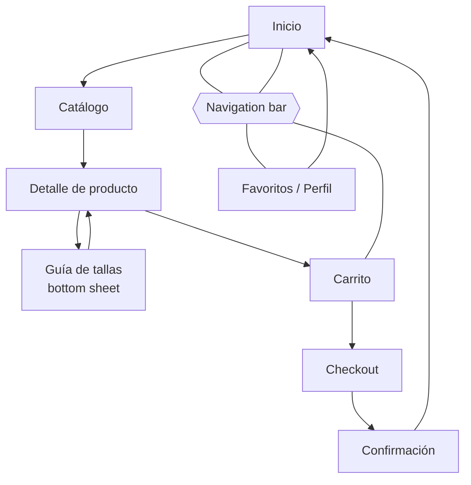

Documentación de la interfaz — Trotitos

1. Justificación del diseño

## 1.1 Importancia del diseño centrado en el usuario

    Trotitos vende ropa y calzado de 0 a 14 años. Quien compra casi nunca es quien usa la prenda: son madres, padres, abuelos y personas que hacen un regalo, con poco tiempo, una sola mano libre (la otra sujeta al niño o la bolsa) y mucha inseguridad con las tallas. Una devolución por talla errónea cuesta dinero al negocio y confianza al cliente. Diseñar partiendo de cómo compran estas personas, y no de cómo es el catálogo interno de la tienda, reduce errores, abandonos y devoluciones. Por eso la app se apoya en Material Design 3 (patrones conocidos por cualquier usuario de Android) y en pruebas con usuarios reales.

## 1.2 Objetivos y metas del proyecto

    -Rapidez: que un usuario complete una compra (Inicio → Confirmación) en menos de 2 minutos.

    -Seguridad en la talla: que al menos el 80 % de los participantes en las pruebas encuentre y use la guía de tallas sin ayuda.

    -Usabilidad: que el 100 % de las tareas de prueba se completen con un máximo de 1 error por tarea.

    -Accesibilidad: que todas las parejas color/on-color cumplan un contraste mínimo de 4,5:1 (WCAG AA) y que todas las áreas táctiles midan al menos 48×48 dp.

## 1.3 Beneficios esperados

    -Para el usuario: compra más rápida con una mano, menos dudas con la talla, mensajes de error claros y posibilidad de deshacer acciones (eliminar del carrito).

    -Para el negocio: menos devoluciones por talla, menos abandono de carrito, un canal propio de venta en Android y una imagen de marca coherente y moderna.

2. Investigación y análisis de usuarios

## 2.1 Datos demográficos y segmentación

    -Público principal (compra): adultos de 25 a 70 años que compran para niños de 0 a 14 años. Segmentos:

    -Padres y madres con compra recurrente (25-45 años): compran a menudo, valoran rapidez y repetir compras.

    -Abuelos y familiares (55-75 años): compran de forma puntual, menor soltura digital, necesitan claridad y letra legible.

    -Compradores de regalo (20-60 años): no conocen la talla del niño; necesitan orientación por edad.

    -Contexto de uso: móvil Android, de pie o en movimiento, con una mano, en ratos cortos.

## 2.2 Personas

    -Persona 1: 
    
    Laura Gómez, 34 años, madre que compra a diario

    Contexto: vive en Sevilla, trabaja a jornada completa y tiene dos hijos (2 y 7 años). Compra desde el móvil en el autobús o mientras prepara la cena.

    Objetivos: renovar ropa cuando los niños crecen, repetir tallas ya conocidas, comprar en pocos pasos.

    Frustraciones: formularios largos, perder el carrito, tallas que cambian de una marca a otra, no poder pulsar botones pequeños con una mano.

    -Persona 2: 
    
    Manuel Ortega, 68 años, abuelo que compra un regalo

    Contexto: jubilado, usa el móvil para WhatsApp y poco más. Quiere regalar un pijama a su nieta, que cumple 4 años; no está seguro de su talla.
    
    Objetivos: encontrar un regalo adecuado a la edad, saber qué talla pedir y terminar la compra sin equivocarse.

    Frustraciones: letra pequeña, iconos sin texto, no saber si ha pulsado bien, miedo a comprar mal y no saber devolver.

## 2.3 Análisis de la competencia

| App | Qué hace bien | Qué hace mal | Qué me llevo |
|---|---|---|---|
| Zara | Imágenes grandes y limpias; navegación por categorías clara | Catálogo muy extenso; la elección de talla no ayuda a decidir | Priorizar fotos grandes y una navegación simple |
| H&M | Filtros por talla y color; lista de favoritos | Muchos filtros y pantallas cargadas | Filter chips visibles, pero pocos y bien jerarquizados |
| Kiabi | Sección específica de niños y bebés; precios visibles | Interfaz algo saturada de promociones | Categorías por edad como acceso principal |

## 2.4 Insights y hallazgos clave

| # | Insight | Decisión de diseño |
|---|---|---|
| 1 | Los compradores dudan con las tallas. | Botón «Guía de tallas» en el detalle que abre un bottom sheet con equivalencias por edad y altura. |
| 2 | Se compra con una mano y poco tiempo. | Navigation bar inferior, botones principales abajo y áreas táctiles de 48 dp o más. |
| 3 | Los regalos se piensan por edad, no por talla. | Inicio con categorías por edad (Bebé 0-24 m, Niña, Niño) y chips de edad/talla en el catálogo. |
| 4 | Los errores en formularios provocan abandono. | Text fields M3 con mensaje de ayuda y estado de error explícito en el checkout. |
| 5 | Eliminar por error en el carrito genera miedo a comprar. | Snackbar con acción «Deshacer» al eliminar. |
    

3. Diseño de la interfaz

    ### 3.1 Mapa de navegación

